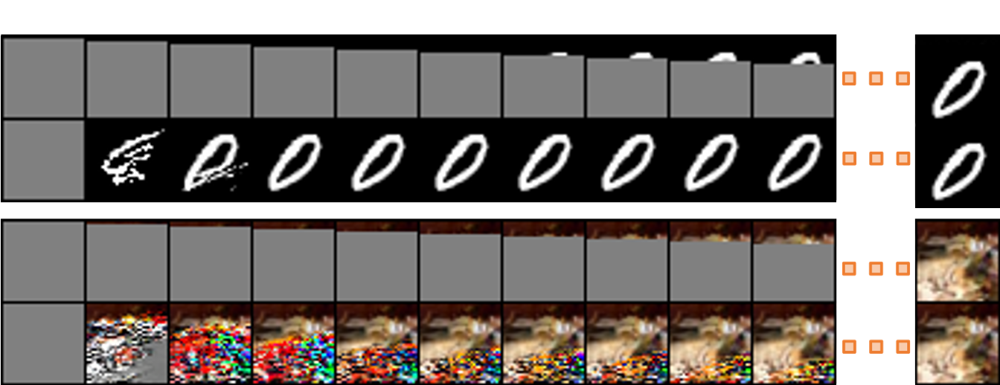

# Accelerating Feedforward Computation via Parallel Nonlinear Equation Solving

This repo contains the official implementation for the ICML 2021 paper [Accelerating Feedforward Computation via Parallel Nonlinear Equation Solving](https://arxiv.org/abs/2002.03629), 

by [Yang Song](https://yang-song.github.io), [Chenlin Meng](https://chenlin9.github.io/), [Renjie Liao](http://www.cs.toronto.edu/~rjliao/), and [Stefano Ermon](https://cs.stanford.edu/~ermon/).

----------------------

We show that by viewing feedforward computation as a system of nonlinear equations, we can leverage parallel equation solvers  to improve its speed. Our methods are particularly efficient when the computation graph contains many long skip connections, and can be used to accelerate the backpropagation of recurrent neural networks, inference of DenseNets, and autoregressive sampling from MADE and PixelCNN++.



## Dependencies

```
jax==0.2.7
jaxlib==0.1.57+cuda101
flax==0.3.2
torch==1.7.1
torchvision==0.8.2
```

## Running experiments

We run experiments by calling  `main.py`  with the following arguments.

```bash
usage: main.py [--runner RUNNER] [--config CONFIG]
arguments:
  --runner RUNNER       The runner to execute
  --config CONFIG       Path to the config file
```

`runner` and `config` can be specified below

| Experiment | --runner | --config |
|:---------------|:---------------:|:------------:|
| RNN backpropagation | `BackpropRunner` | `backprop.yml` |
| DenseNet | `DenseNetRunner` | `densenet.yml` |
| MADE sampling | `MADESamplerRunner` | `made_sampler.yml` |
| PixelCNN++ sequential & Jacobi sampling| `PixelCNNPPSamplerRunner` | `pixelcnnpp_sampler.yml` |
| PixelCNN++ sequential sampling w/ cache | `CachedPixelCNNPPSamplerRunner` | `cached_pixelcnnpp_sampler.yml` |
| PixelCNN++ Jacobi-GS sampling | `JacobiGSPixelCNNPPSamplerRunner` | `jacobi_gs_pixelcnnpp_sampler.yml` |
| PixelCNN++ GS-Jacobi sampling | `GSJacobiPixelCNNPPSamplerRunner` | `gs_jacobi_pixelcnnpp_sampler.yml` |

The configurations of each experiment, such as dataset, block size, and algorithm, are provided in the corresponding config file, which should be straightforward to modify.

## Retrieving experimental results

After running `main.py`, we can retrieve and plot experimental results by running `*.ipynb` files with Jupyter Notebook. We assume all experimental data are stored in folder `plot_data/`. Here is the correspondence between each experiment and the `.ipynb` file.

| Experiment | Jupyter Notebook file |
|:----------|:---------------------:|
| RNN backpropagation           |  `rnn_backprop.ipynb` |
| DenseNet | `densenet.ipynb` |
| MADE sampling | `made.ipynb` |
| PixelCNN++ sampling | `pixelcnnpp.ipynb` |

## Pretrained checkpoints and raw experimental data

We provide pretrained checkpoints (in subfolder `runs/pretarined`) and raw experimental data (in subfolder `plot_data`) via the following link:

https://drive.google.com/file/d/1cxV3pKUmLETt9veWRnEKt3SBCb-6sZDc/view?usp=sharing

## Reference

If you find the idea or code useful for your research, please consider citing
```bibtex
@inproceedings{song2021accelerating,
  title={Accelerating Feedforward Computation via Parallel Nonlinear Equation Solving},
  author={Song, Yang and Meng, Chenlin and Liao, Renjie, and Ermon, Stefano},
  booktitle = {International Conference on Machine Learning (ICML)},
  year={2021},
}
```

